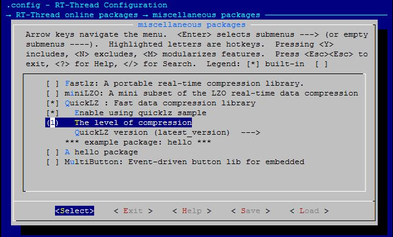

# QuickLZ

[中文页](README_ZH.md) | English

## 1. Introduction

QuickLZ is known as the fastest compression library in the world, with a speed of 308 Mbyte/s per core, simple to use and easy to integrate. This [quicklz](https://github.com/RT-Thread-packages/quicklz) library is RT-thread for the official [qiuicklz](http://www.quicklz.com/download.html) C library Porting. For more information about quicklz, please refer to [http://www.quicklz.com](http://www.quicklz.com).

## 2. How to obtain

- Obtain by Git:
`git clone https://github.com/RT-Thread-packages/quicklz.git`

- env tool to assist download:
  menuconfig package path: `RT-Thread online package` -> `miscellaneous package` -> `QucikLZ`

## 3. Example introduction

### 3.1 Get examples

- Configure the enable sample option `Enable using quizklz sample`;
- Configure the compression level option, set to level 1 (there are three levels 1/2/3, level 1 has the fastest compression speed and the smallest compression ratio, and level 3 has the fastest compression speed and the largest compression ratio);
- The configuration package version is selected as the latest version `latest_version`.



### 3.2 Run example
This example is a simple file compression and decompression routine, which depends on the file system. The commands used are two `-c` and `-d`. The `-c` command compresses one file to another, ` The -d` command decompresses a file to another file.
Usage: msh cmd `qlz_test -c /file.bin /file.cmprs.bin` `qlz_test -d /file.cmprs.bin /file_dcmprs.bin`

```
msh />qlz_test -c /file.bin /file.cmprs.bin
[qlz]compress start: >>>>>>>>>>>>>>>>>>>>>>>>>>>>>>>>>>>>>>>>>>>> >>>>>>>>>>>>>>>>>>>>>>>>>>>>
[qlz]compressed 469848 bytes into 363495 bytes, compression ratio is 77%!
msh />
msh />qlz_test -d /file.cmprs.bin /file_dcmprs.bin
[qlz]decompress start: >>>>>>>>>>>>>>>>>>>>>>>>>>>>>>>>>>>>>>>>>>>> >>>>>>>>>>>>>>>>>>>>>>>>>>>>
[qlz]decompressed 363495 bytes into 469848 bytes!
```
## 4. Common problems

### 4.1 Out of memory problem

   `[qlz] No memory for state_compress struct, need 36868 byte, or you can change QLZ_HASH_VALUES to 1024!`

Reason: The memory space required for quicklz library compression is relatively large, and the device memory space is insufficient
Solution: Modify the size of `QLZ_HASH_VALUES` under the current level in the `quicklz.h` file

## 5. Reference materials

- QuickLZ official website: http://www.quicklz.com
- QuickLZ official manual: [manual](http://www.quicklz.com/manual.html)
